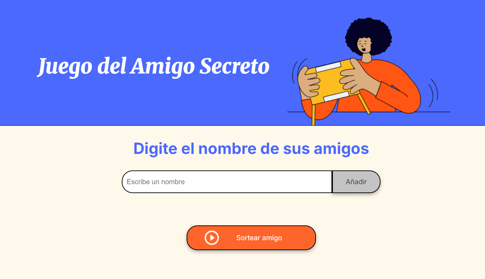
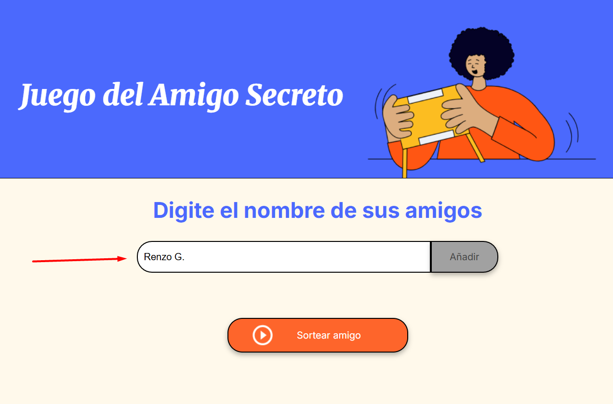
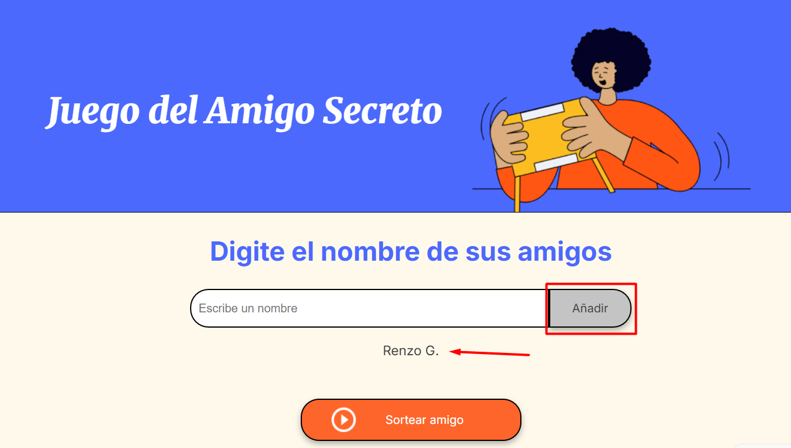
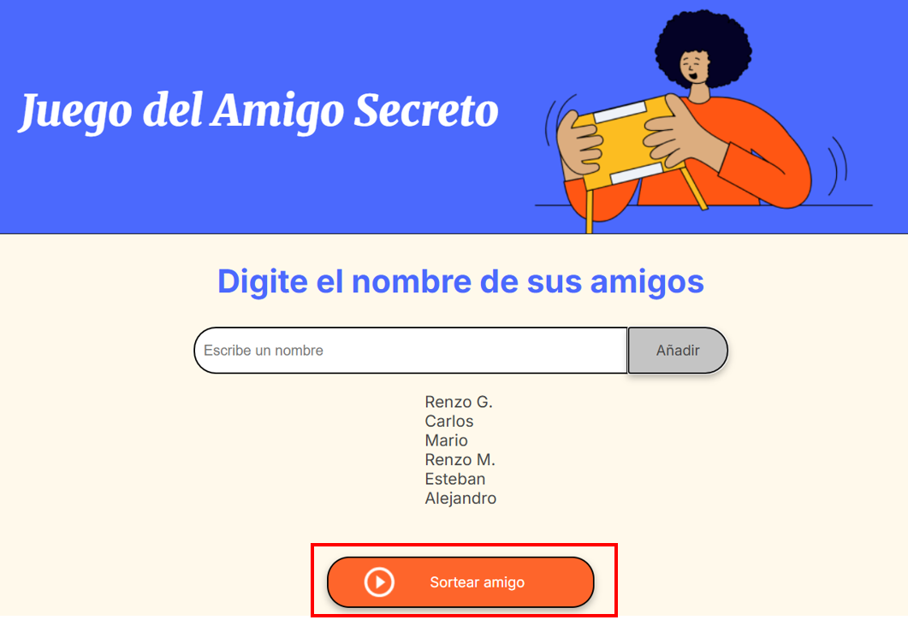
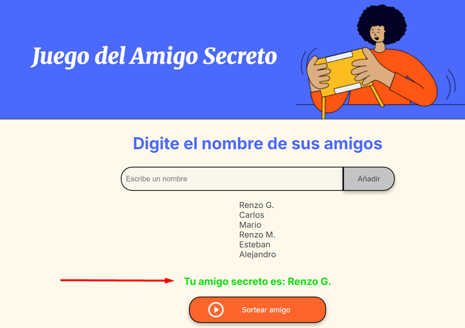

# <h1 align="center">Challenge Alura: Amigo Secreto</h1>
   

## Descripción del proyecto
Este desafio (challenge) consistió en desarrollar una aplicación que permita al usuario ingresar el nombre del (los) amigo(s) en una lista, para luego realizar un sorteo aleatorio y determinar quien es el **"amigo secreto"**.




## 🔨 Funcionalidades de la aplicación
- `Agregar nombres`: Los usuarios escribirán el nombre de un amigo en un campo de texto y lo agregarán a una lista visible al hacer clic en **"Añadir"**.
- `Validar entrada`: Si el campo de texto está vacío, o solo contiene espacios en blanco, el programa mostrará una alerta indicando <i>"Dato invalido, debe ingresar un nombre"</i>.
- `Visualizar la lista`: Los nombres ingresados aparecerán en una lista debajo del campo de entrada.
- `Sorteo aleatorio`: Al hacer clic en el botón **"Sortear amigo"**, se seleccionará aleatoriamente un nombre de la lista y se mostrará en la página.

<u>Funcionalidades adicionales</u>
- `Descartar duplicidad en entrada`: En el caso de querer ingresar más de una vez un nombre, el programa mostrará una alerta indicando <i>"Este nombre ya fue ingresado, por favor digite un diferente"</i>.
- `Ingreso de lista de amigos antes de sortearla`: Se bloquea temporalmente el botón de **"Sortear amigo"** mediante la alerta <i>"Primero debe ingresar el nombre de su(s) amigo(s) y picar el botón de Añadir (Tantas veces sea necesario)"</i>.

## 🚀 Comenzando

Estas instrucciones te permitirán obtener una copia del proyecto en funcionamiento en tu máquina local para propósitos de desarrollo y pruebas.

Lea [Clonando un repositorio remoto](https://www.aluracursos.com/blog/clonando-un-repositorio-remoto?utm_source=gnarus&utm_medium=timeline) para conocer como clonar el presente proyecto

### 📋 Pre-requisitos
No se necesita herramientas o aplicativos adicionales para ejecutar este desafio. Solo se necesita un navegador web como Firefox, Chrome u otro equivalente.
Para editar el código fuente elaborado, se empleó el Visual Studio Code, sin embargo es posible emplear un editor diferente de ser necesario.

### 🔧 Instalación
1. Clone el repositorio en su ordenador local:
    ```bash
    git clone https://github.com/rpastorc/Challenge-amigo-secreto.git
    ```
2. Navegue en el directorio del proyecto:
    ```bash
    cd challenge-amigo-secreto
    ```
3. Abra el archivo `index.html` en el navegador de su preferencia para empezar a usar la aplicación.

## ⚙️ Ejecutando las pruebas
### 📢 Instrucciones de uso
1. Una vez cargada la pagina, debe de ingresar un nombre en  el cajetín correspondiente.**(*)** 



2. Presione el boton de **Añadir** para que el nombre pueda ser incluido en la lista de amigos por considerar en el sorteo.



3. La lista de nombres se ira generando debajo del cajetín para su verificación, por lo que deberá repetir los dos primeros pasos hasta haber comprobado que todos los nombres deseados se encuentran enlistados.


4. Una vez registrado la totalidad de nombres deseados, deberá de presionar el botón **Sortear amigo**, ubicado en la parte inferior de la página.



5. Habiendo presionado el botón **Sortear amigo**, aparecerá sobre este un mensaje con el nombre del amigo sorteado.



6. Finalmente, habiendo obtenido el nombre del amigo secreto, se bloquerará automaticamente el ingreso de nuevos nombres y la posibbilidad de realizar nuevos sorteos, por lo que deberás de actualizar la página para iniciar uno nuevamente.

**(*)** Tener en cuenta que no se podrá ingresar dos nombres iguales (sugerimos diferenciarlos agregando las iniciales de su segundo nombre en caso los tenga, o su apellido)

## 🛠️ Construido con
- [JavaScript](https://developer.mozilla.org/en-US/docs/Web/JavaScript) - Como lenguaje de programación (secuencia de comandos).
- [Visual Studio Code](https://code.visualstudio.com/) - Para la edición del codigo fuente (archivos .js, .html, .css y .md).
- [Shields.io](https://shields.io/) - Para los badges.

## ✒️ Autor
* **Renzo Pastor** - Challenge amigo secreto - [rpastorc](https://github.com/rpastorc)


